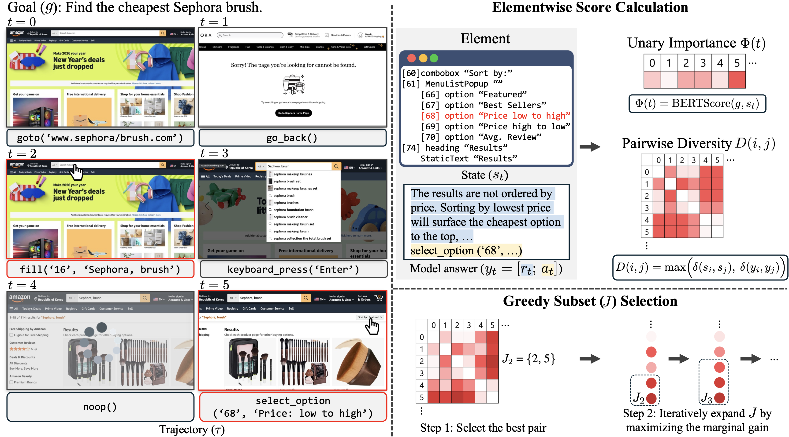

# WEASEL

Official code for the ICML 2026 paper **WEASEL: Out-of-Domain Generalization for Web Agents via Importance-Diversity Data Selection**.

[[Paper](https://arxiv.org/abs/2605.20291)] [[Project Page](https://fatemehpesaran310.github.io/projects/weasel.html)]

WEASEL selects compact, goal-relevant, and diverse web-agent trajectory steps to improve out-of-domain generalization while reducing training cost.



This repository currently contains the cleaned data-selection pipeline:

0. Prune AXTree states.
1. Compute goal-relevance and pairwise distance scores.
2. Run the WEASEL greedy subset-selection objective.
3. Build the final training subset, including length filtering and 10K subsampling.

We do not include the original training datasets in this repository. To download
AgentTrek, please refer to the official [xlang-ai/AgentTrek](https://github.com/xlang-ai/AgentTrek)
repository. In the commands below, replace `path/to/train.json` with the local
path to the downloaded training file.

If you want to skip the preprocessing steps and directly use our WEASEL-selected
training dataset, it will be available here:

- WEASEL-selected AgentTrek training dataset: [weasel_agenttrek_train_10k.json](https://drive.google.com/file/d/175XAk5NyMxVDRhJUN8x72V7EOfNVWUp2/view?usp=sharing)

## 0. AXTree Pruning

We use target-centered AXTree pruning before score computation. The cleaned
pruning script will be added soon.

```bash
python -m weasel.prune_axtree \
  --input path/to/train.json \
  --output path/to/train_pruned.json
```

## 1. Prepare Scores

Run score preprocessing on the downloaded training data:

```bash
python -m weasel.prepare_scores \
  --input path/to/train_pruned.json \
  --output path/to/goals_with_scores.json \
  --augmented-dataset-output path/to/train_with_phi_scores.json
```

## 2. Greedy Selection

Run greedy subset selection using the precomputed scores:

```bash
python -m weasel.select_greedy \
  --input path/to/goals_with_scores.json \
  --output path/to/full_selected_dataset_indices_T0_3.json
```

## 3. Postprocess Dataset

Build the final WEASEL training subset:

```bash
python -m weasel.postprocess_dataset \
  --dataset path/to/train_pruned.json \
  --selected-indices path/to/full_selected_dataset_indices_T0_3.json \
  --output path/to/weasel_train_10k.json \
  --max-user-chars 40000 \
  --max-examples 10000 \
  --seed 0
```

## Training

For supervised fine-tuning, we used [hiyouga/LLaMA-Factory](https://github.com/hiyouga/LLaMA-Factory).
After building the WEASEL-selected training file, you can use it as the training
dataset in a LLaMA-Factory SFT run.

If you want to directly use our trained model checkpoints, they will be available
here:

- Qwen2.5-7B-Instruct WEASEL checkpoint: TODO
- Gemma3-4B-IT WEASEL checkpoint: TODO
- Qwen3-8B WEASEL checkpoint: TODO

## Evaluation

For WebArena evaluation, please refer to [web-arena-x/webarena](https://github.com/web-arena-x/webarena).

For MiniWob evaluation, please refer to the [MiniWob documentation](https://miniwob.farama.org/content/viewing/)
and [Farama-Foundation/miniwob-plusplus](https://github.com/Farama-Foundation/miniwob-plusplus).

For WorkArena evaluation, please refer to [ServiceNow/WorkArena](https://github.com/ServiceNow/WorkArena).

## Citation

```bibtex
@inproceedings{pesaranzadeh2026weasel,
  title     = {{WEASEL}: Out-of-Domain Generalization for Web Agents via Importance-Diversity Data Selection},
  author    = {Pesaran Zadeh, Fatemeh and Choi, Seyeon and L\`u, Xing Han and Reddy, Siva and Kim, Gunhee},
  booktitle = {Proceedings of the 43rd International Conference on Machine Learning},
  year      = {2026}
}
```
